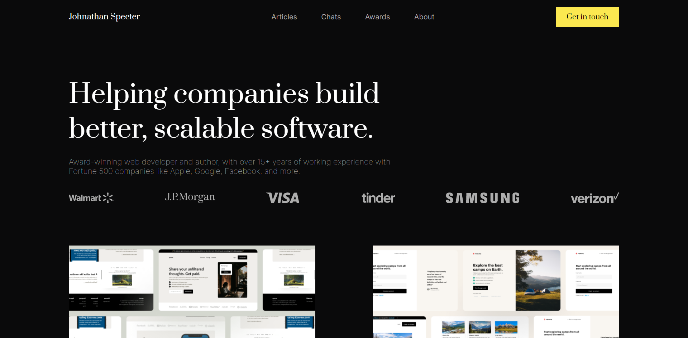

# Codewell Project - Web Developer Portfolio

## My Solution

### Screenshot

### Built with

- Semantic HTML5 markup
- CSS custom properties
- CSS Flexbox
- JavaScript

### Fonts Used

- [Headings](https://fonts.google.com/specimen/Prata)
- [Body](https://fonts.google.com/specimen/Inter)

### Links

- View Site: [GitHub Page](https://mikeattah.github.io/codewell-web-developer-portfolio/)

## Author

- Website: [mikeattah.com](https://www.mikeattah.com)
- Frontend Mentor: [@mikeattah](https://www.frontendmentor.io/profile/mikeattah)
- Twitter: [@mikeattahh](https://www.twitter.com/mikeattahh)
